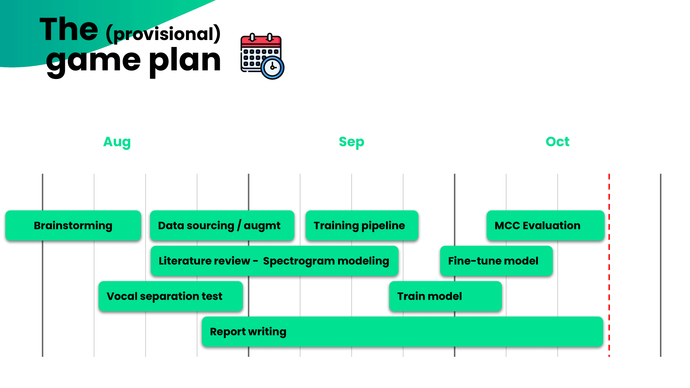
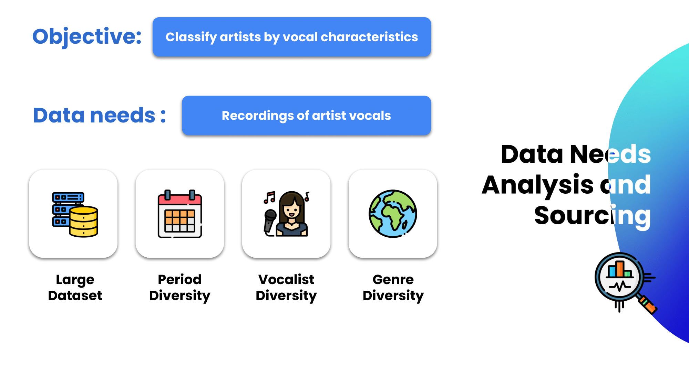
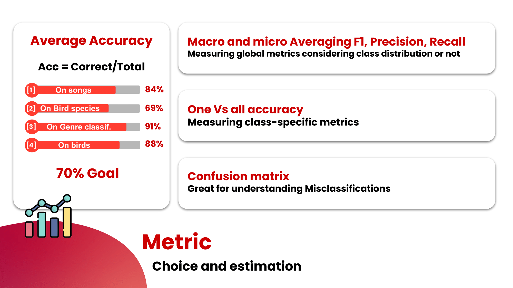

# Spectrogram Artist recognition through computer vision

This repo shows the work of Julien Guinot on his independent applied machine learning projec tin the context of the University of Adelaide's applied machine learning course. In this repo you will find:

- A readme containing the presentations done over the course of this project
- the final report containing all necessary info and bibliography to understand the project
- The source code for the project

## Pitch

## Data and project goals

## Methodology

## Results

